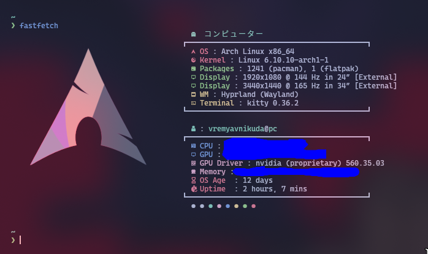

# dotfiles arch
___


There are a few particular files/directories to note in here:

-   [hypr config](hypr)
-   [nvim config](nvim)

> [arch wiki](https://wiki.archlinux.org/title/Main_page)
> [aur.chaotic](https://aur.chaotic.cx/)

___
### reset-machine-id.sh
```bash
chmod +x reset-machine-id.sh
```
Запусти с правами root или через sudo:

```bash
sudo ./reset-machine-id.sh
```